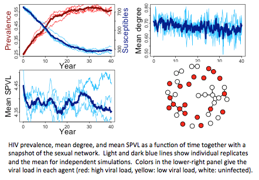

VERY PRELIMINARY DRAFT: WORK IN PROGRESS
================
EvoNetHIV -- Agent based model for simulating HIV epidemics
================
Evonet Team: Steven Goodreau, Joshua Herbeck, John Mittler, James Murphy, Kathryn Peebles, Sarah Stansfield, Juandalyn Burke, Neil Abernethy, Geoffrey Gottlieb

2017-10-18

EvonetHIV is a stochastic agent-based simulation model that incorporates sexual network structure, behavior, HIV evolution, and treatment. Each simulation first estimates a statistical model that governs sexual network structure, and then proceeds through a burn-in period and epidemic simulation. At each time step of both the burn-in period and epidemic simulation, (1) partnerships form and dissolve; (2) sexual acts take place within a subset of existing partnerships; (3) HIV transmission occurs probabilistically within a subset of sexual acts; (4) viral dynamics and disease progression are updated for each infected agent; (5) vital dynamics, such as aging, are updated, and (6) testing and treatment are implemented at user-specified intervals.

[Overview of model dynamics](./overview_link.md)  
[Quick start example](./Quick_start_overview.md)  
[Agent attributes overview](./EvoNet_Agent_Attributes_Overview.md)

