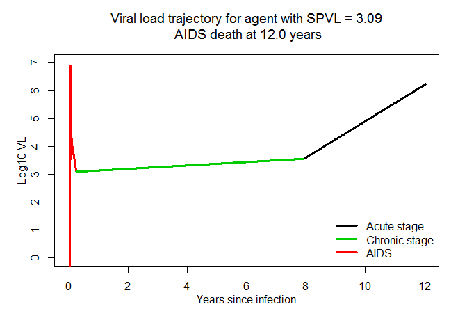
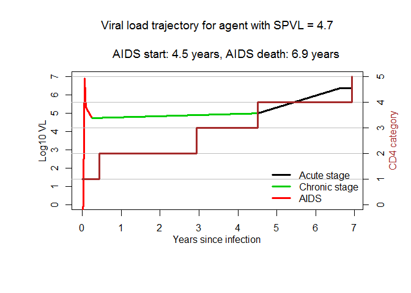

VERY PRELIMINARY DRAFT: WORK IN PROGRESS
================
EvoNetHIV -- Agent based model for simulating HIV epidemics
================
Evonet Team: Steven Goodreau, Joshua Herbeck, John Mittler, James Murphy\*, Kathryn Peebles, Sarah Stansfield, Juandylan Burke, Neil Abernethy, Geoffrey Gottlieb

2017-10-18

EvonetHIV is a stochastic agent-based simuln model that incorporates sexual network structure, behavior, HIV evolution, and treatment. Each simulation first estimates a statistical model that governs sexual network structure, and then proceeds through a burn-in period and epidemic simulation. At each time step of both the burn-in period and epidemic simulation, (1) partnerships form and dissolve; (2) sexual acts take place within a subset of existing partnerships; (3) HIV transmission occurs probabilistically within a subset of sexual acts; (4) viral dynamics and disease progression are updated for each infected agent; (5) vital dynamics, such as aging, are updated, and (6) testing and treatment are implemented at user-specified intervals.

## Viral Load progression overview
At infection, agent's viral load (VL) begins at initial VL value of 1e-4. The following acute phase last 90 days and has an exponential increase to the peak of the acute phase and then a bi-phasic decline to the SPVL value. After the acute phase, the chronic phase begins with viral load at the SPVL and progresses with a slight increase in VL. At the beginning of the AIDS phase (triggered when CD4 counts fall &lt;200), a linear increase to the assumed maximum VL value in AIDS (6.38 log10) starts.

The figure below shows a progression for an agent that has a low SPVL. This results in the chronic phase starting at the low SPVL and a noticeable increase in VL occurs at the beginning of the AIDS stage. 

## CD4 progression overview
Categorical values (1,2,3,4), Cori and Pickles, etc.

